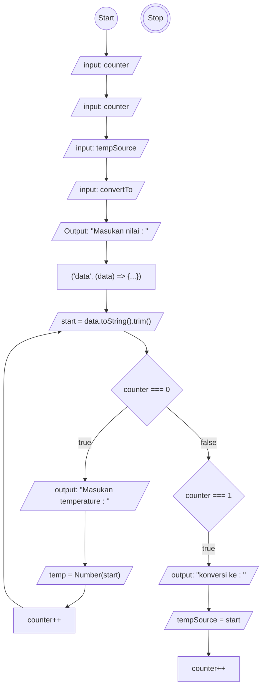

# Flowchart Task 4

## Konversi Suhu

```mermaid
    flowchart TB
        Start@{ shape: circ, label: "Start"}

        counter@{ shape: lean-r, label: "input: counter"}
        temperature@{ shape: lean-r, label: "input: counter"}
        tempSource@{ shape: lean-r, label: "input: tempSource"}
        convertTo@{ shape: lean-r, label: "input: convertTo"}
        firstPrint@{ shape: lean-r, label: "Output: ''Masukan nilai : ''"}

        %% PROSES BAKALAN PENTING !!!
        proccess@{ shape: rect, label: "('data', (data) => {...})"}

        starting@{ shape: lean-r, label: "start = data.toString().trim()"}

        %% CONDITION
        %% Counter 0
        counter0@{ shape: diamond, label: "counter === 0"}
        counter0True@{ shape: lean-r, label: "output: ''Masukan temperature : ''"}
        temp0@{ shape: lean-r, label: "temp = Number(start)"}
        counterInc0@{ shape: rect, label: "counter++"}

        %% COUNTER 1
        counter1@{ shape: diamond, label: "counter === 1"}
        counter1True@{ shape: lean-r, label: "output: ''konversi ke : ''"}
        temp1@{ shape: lean-r, label: "tempSource = start"}
        counterInc1@{ shape: rect, label: "counter++"}
        %% temp = Number(start)

        %% sambungna Start dan counter 0
        Start-->counter-->temperature-->tempSource-->convertTo-->firstPrint-->proccess-->starting-->counter0-->|true|counter0True-->temp0-->counterInc0-->starting
        %% sambungna Start dan counter 1
        counter0-->|false|counter1-->|true|counter1True-->temp1-->counterInc1

        Stop@{ shape: dbl-circ, label: "Stop"}

```
